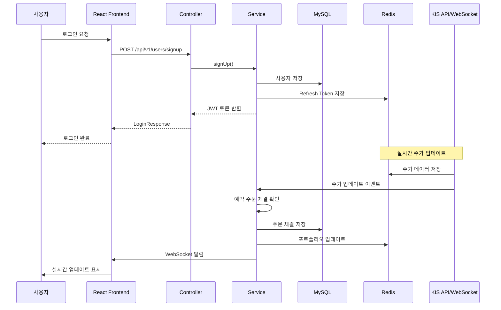

## 💡 기획 배경

주식 투자를 연습하고 싶지만 주식을 할 자본금이 부족한 사람들을 위한 실시간 주식 데이터를 활용한 모의 투자 플랫폼입니다. 한국투자증권(KIS) API를 연동하여 실제 주식 시세를 기반으로 매수/매도, 포트폴리오 관리, 랭킹 시스템 등을 제공합니다.


<br>
<br>


## 📋 목차

- [프로젝트 개요](#프로젝트-개요)
- [기술 스택](#기술-스택)
- [프로젝트 구조](#프로젝트-구조)
- [ERD](#ERD)
- [아키텍처 구조도](#아키텍처)
- [API 문서](#api-문서)
- [데이터 흐름도](#data-flow)
- [주요 기능](#주요-기능)


<br>
<br>

## 🎯 프로젝트 개요

이 프로젝트는 **Spring Boot**와 **React**를 기반으로 한 실시간 주식 모의 투자 플랫폼입니다. 한국투자증권(KIS) Open API를 활용하여 실제 주식 시세를 실시간으로 받아오고, 사용자가 모의 투자를 통해 주식 거래를 체험할 수 있습니다.

### 주요 특징

- 🔐 **JWT 기반 인증 시스템** (Access Token + Refresh Token)
- 🔄 **실시간 주가 데이터** (WebSocket + STOMP)
- 📊 **인터랙티브 차트** (Lightweight Charts)
- 💼 **포트폴리오 관리** 및 **랭킹 시스템**
- ⚡ **즉시 주문** 및 **예약 주문** 기능
- 🌐 **OAuth2 소셜 로그인** (카카오, 네이버)
- 🧪 **단위, 통합 테스트** (Mocktio, Testcontainers)


<br>
<br>

## 🛠 기술 스택

### Backend


- **Java 17** 
- **Spring Boot 3.5.6**
  - Spring Security
  - Spring Data JPA
  - Spring WebSocket (STOMP)
  - Spring WebFlux (WebClient)
- **MySQL 8.0+** (Flyway 마이그레이션)
- **Redis Sentinel** (실시간 데이터 캐싱 및 정렬)
- **JWT** (io.jsonwebtoken)
- **OAuth2 Client** (카카오, 네이버)
- **Docker**

### Frontend


- **React 18.3.1**
- **TypeScript**
- **Vite**
- **Lightweight Charts** (TradingView 차트 라이브러리)
- **STOMP.js** (WebSocket 통신)
- **React Router DOM**

### Testing


- **JUnit 5**
- **Mockito**
- **Testcontainers** (MySQL, Redis)
- **MockMvc**


<br>
<br>

## 📁 프로젝트 구조

```
stock/
├── src/main/java/com/project/demo/
│   ├── common/                    # 공통 모듈
│   │   ├── config/                # 설정 클래스
│   │   ├── exception/             # 예외 처리
│   │   ├── jwt/                   # JWT 유틸리티
│   │   ├── kis/                   # KIS API 연동
│   │   ├── oauth2/                # OAuth2 설정
│   │   ├── redis/                 # Redis 설정
│   │   ├── response/              # 공통 응답 형식
│   │   ├── util/                  # 유틸리티
│   │   └── websocket/             # WebSocket 설정
│   ├── domain/                    # 도메인별 모듈
│   │   ├── execution/             # 체결 내역
│   │   ├── order/                 # 주문
│   │   ├── portfolio/             # 포트폴리오
│   │   ├── stock/                 # 주식 정보
│   │   ├── user/                  # 사용자
│   │   └── userstock/             # 보유 주식
│   └── StockApplication.java      # 메인 애플리케이션
├── src/main/resources/
│   ├── application.yml            # 설정 파일
│   └── db/migration/mysql/        # Flyway 마이그레이션
├── src/test/                      # 테스트 코드
│   ├── java/.../integration/      # 통합 테스트
│   └── java/.../domain/           # 단위 테스트
└── frontend/                      # React 프론트엔드
    ├── src/
    │   ├── pages/                 # 페이지 컴포넌트
    │   ├── components/            # 공통 컴포넌트
    │   └── lib/                   # 유틸리티
    └── package.json
```


<br>
<br>


## ERD


<br>
<br>


## 아키텍처 구조도


<br>
<br>


## 📡 API 문서

### WebSocket 엔드포인트

| 경로 | 설명 |
|------|------|
| `/ws` | WebSocket 연결 엔드포인트 (SockJS 지원) |
| `/topic/stocks` | 실시간 주식 시세 구독 |
| `/topic/portfolio/{userId}` | 포트폴리오 업데이트 알림 |
| `/topic/user-stocks/{userId}` | 보유 주식 업데이트 알림 |
| `/topic/order-notification/{userId}` | 주문 체결 알림 |

<br>

### 사용자 API

| Method | Endpoint | Description |
|--------|----------|-------------|
| POST | `/api/v1/users/sign-up` | 회원가입 |
| POST | `/api/v1/users/login` | 로그인 |
| POST | `/api/v1/users/logout` | 로그아웃 |
| POST | `/api/v1/users/reissue` | Access Token 재발급 |
| GET | `/api/v1/users/{userId}` | 사용자 정보 조회 |
| PATCH | `/api/v1/users/{userId}` | 사용자 정보 수정 |
| PATCH | `/api/v1/users/password` | 비밀번호 변경 |
| DELETE | `/api/v1/users/{userId}` | 회원 탈퇴 |

<br>

### 주식 API

| Method | Endpoint | Description |
|--------|----------|-------------|
| GET | `/api/v1/stocks` | 전체 주식 목록 조회 |
| GET | `/api/v1/stocks/{ticker}/outline` | 기업 개요 조회 |
| GET | `/api/v1/stocks/{ticker}/period` | 기간별 차트 데이터 |
| GET | `/api/v1/stocks/{ticker}/period/range` | 기간별 차트 데이터 (범위 지정) |

<br>

### 주문 API

| Method | Endpoint | Description |
|--------|----------|-------------|
| POST | `/api/v1/orders/buying/{ticker}` | 즉시 매수 |
| POST | `/api/v1/orders/selling/{ticker}` | 즉시 매도 |
| POST | `/api/v1/orders/reserve-buying/{ticker}` | 예약 매수 |
| POST | `/api/v1/orders/reserve-selling/{ticker}` | 예약 매도 |
| DELETE | `/api/v1/orders/{orderId}` | 예약 주문 취소 |
| GET | `/api/v1/orders` | 전체 주문 내역 |
| GET | `/api/v1/orders/normal` | 일반 주문 내역 |
| GET | `/api/v1/orders/reservation` | 예약 주문 내역 |

<br>

### 포트폴리오 API

| Method | Endpoint | Description |
|--------|----------|-------------|
| GET | `/api/v1/portfolios/users/{userId}` | 포트폴리오 조회 |
| GET | `/api/v1/portfolios/ranking` | 랭킹 조회 |


<br>
<br>


## 데이터 흐름도




<br>
<br>


## ✨ 주요 기능

### 1. 사용자 인증 및 관리

#### 1.1 회원가입 / 로그인 (JWT 토큰 기반 인증)
- 이메일 기반 회원가입
  


<br>
  
- 소셜 로그인 (카카오, 네이버)
  


<br>


<br>

#### 1.2 토큰 재발급
- Refresh Token을 이용한 Access Token 자동 갱신
- Access Token (60분) + Refresh Token (14일)
- 쿠키 기반 Refresh Token 관리

<br>

#### 1.3 사용자 정보 관리
- 개인정보 조회/수정
- 비밀번호 변경
- 회원 탈퇴
  


<br>
<br>


### 2. 실시간 주식 데이터

#### 2.1 주식 정보 조회
- 전체 주식 목록 조회 (거래량, 가격, 급상승, 급하락 순 정렬)
- 실시간 현재가, 등락률, 거래량 조회

#### 2.2 실시간 주가 업데이트
- 한국투자증권 WebSocket을 통한 실시간 주가 수신
- Redis에 주가 데이터 저장 및 정렬
- STOMP를 통한 클라이언트 실시간 전송


<br>
<br>


### 3. 차트 및 시각화

#### 3.1 캔들스틱 차트
- Trading View의 Light-Weight 캔들 차트 라이브러리 이용
- 일/주/월/년 단위 선택 캔들 차트
- 무한 드래그를 통한 과거 데이터 및 차트 확인
- 툴팁으로 상세 정보 표시
- 각 종목별 기업 개요 정보 표시


<br>
<br>

### 4. 주문 시스템

#### 4.1 즉시 주문
- 즉시 매수: 현재가로 즉시 체결
- 즉시 매도: 보유 주식을 현재가로 즉시 매도


<br>


#### 4.2 예약 주문
- 예약 매수: 목표가 이하로 하락 시 자동으로 매수 체결
- 예약 매도: 목표가 이상으로 상승 시 자동으로 매도 체결
- 예약 주문 체결시 웹 브라우저 알림 전송


<br>

#### 4.3 주문 내역 조회
- 전체 주문 내역 조회
- 일반 주문(즉시 주문) 내역 조회
- 예약 주문 내역 조회
- 예약 주문 취소 기능


### 4. 포트폴리오 관리

#### 4.1 포트폴리오 조회
- 현금 잔액(자본금 1000만원)
- 보유 주식의 실시간 총액
- 총 자산(현금 + 보유 주식)
- 보유 종목 수
- 실시간 자산, 수익률 갱신


<br>
<br>

## 🧪 테스트(라인 커버리지 72%)

### 단위 테스트
- Service 계층 단위 테스트 (Mockito)
- Controller 계층 테스트 (MockMvc)

### 통합 테스트
- Testcontainers를 이용한 MySQL, Redis 통합 테스트
- 실제 데이터베이스 환경에서 API 테스트


